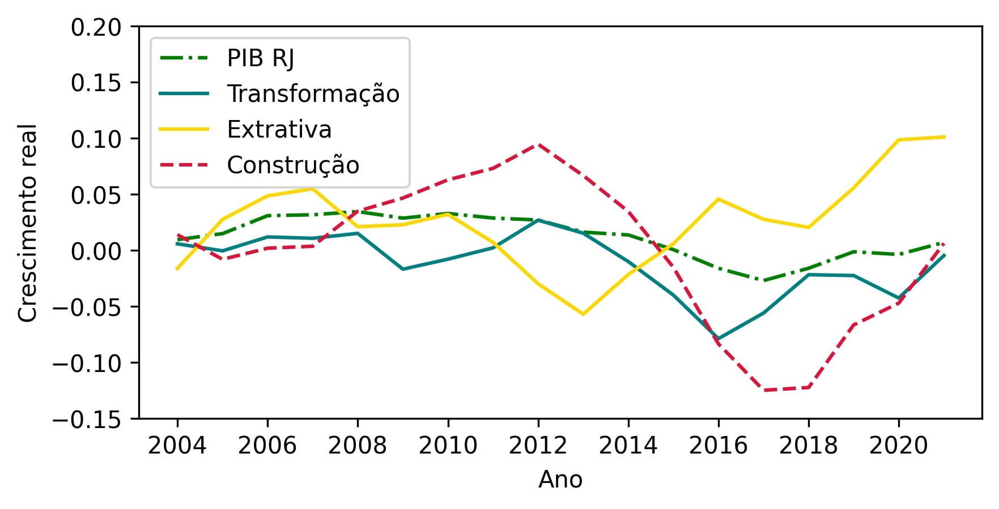

# **Capítulo 1: Projeto de qualificação**

## **Introdução**

O projeto a seguir propõe uma sociologia histórica e multiescalar do
processo de desindustrialização brasileiro. Como problema se indaga:
qual a relação entre transformações institucionais e o processo de
desindustrialização brasileiro? Seu objetivo geral é compreender como
instituições políticas e econômicas influenciaram esse processo em
diferentes escalas geográficas. Para isso, utiliza de métodos
comparativos e de rastreamento de processos. Empiricamente, analisa
materiais qualitativos, dos planos de desenvolvimento nacionais aos
projetos de consórcio intermunicipais, e quantitativos, com ênfase em
séries temporais elaboradas a partir das Contas Nacionais, das Contas
Regionais, do Produto Interno Bruto (PIB) Municipal e de pesquisas sobre
produção e emprego.

A hipótese central é que novos arranjos institucionais, frutos dos
ciclos de crescimento e crise da economia brasileira durante a segunda
metade do século XX, aceleraram e aprofundaram o processo de
desindustrialização brasileiro. Como consequência, houve em menor
crescimento econômico, menor sofisticação tecnológica dos setores
econômicos[^1], menor produtividade do trabalhador, piores condições de
trabalho e inserção mais precária do país na economia mundial.

Além deste capítulo, o projeto contém um capítulo específico para
discussão metodológica e outro para discussão sobre o fenômeno da
desindustrialização em sua escala global[^2]. Já o restante deste
capítulo contém quatro seções: 1- objeto e discussão da hipótese; 2 -
justificativa e breve histórico da desindustrialização brasileira; 3 -
teoria geral; 4 - os objetivos gerais e específicos e 5 - o cronograma
proposto e a estrutura da tese.

## **1. Objeto e discussão da hipótese**

O objeto da investigação são os efeitos das transformações
institucionais políticas e econômicas sobre o processo de
desindustrialização brasileiro e seus desdobramentos. No país, a
desindustrialização, que pode numa simplificação ser entendida como a
redução contínua da participação do setor industrial na economia e no
estoque de empregos [(Tregenna,
2009)](https://www.zotero.org/google-docs/?kiAalY), ocorreu de forma
consistente e mais intensa a partir dos anos 1980 [(Oreiro e Feijó,
2010)](https://www.zotero.org/google-docs/?B3wCNB). É possível a partir
das Contas Nacionais [(IBGE,
\[s.d.\])](https://www.zotero.org/google-docs/?kIvHAO), porém,
identificar episódios prévios do fenômeno, como no período de 1961 até
1966. Tal recorte temporal, de aproximadamente 1961 até os dias atuais,
é marcado por significativos ciclos de crescimento e crise econômica
[(Souza e Previdelli, 2022; Vianna e Villela,
2015)](https://www.zotero.org/google-docs/?LxtZo0), reincidentes crises
políticas (idem) e significativa variação da atividade industrial
[(Morceiro, 2021)](https://www.zotero.org/google-docs/?r3fjx6).

Ao longo desses ciclos, transformações institucionais significativas
foram implementadas, em grande parte em resposta a esses ciclos e por
influência de elites políticas e econômicas. Pode-se identificar
mudanças de regime político, de política econômica e tributária, criação
e privatização de empresas estatais, fortalecimento e enfraquecimento de
autarquias, mudanças na legislação trabalhista e tributária, mudanças de
regime cambial e nas regras do comércio externo, para citar algumas
[(Abreu, 2014; Souza e Previdelli, 2022; Vianna e Villela,
2015)](https://www.zotero.org/google-docs/?GdUIm4). Alternou-se entre e
se combinou abertura comercial e protecionismo, liberalismo e
intervencionismo, autoritarismo e democracia.

O fenômeno também apresenta variações na escala estadual e sub-regional.
Sinal disso é que arranjos institucionais ligados a estados e
territórios -- subsídios fiscais, diferentes níveis salariais médios e
diferentes características da atuação sindical [(Ramalho, 2004,
2015)](https://www.zotero.org/google-docs/?gbGa0G), por exemplo -- têm
contribuído para a desconcentração industrial brasileira [(CNI,
2021)](https://www.zotero.org/google-docs/?qvqIuo), que ocorre
paralelamente à redução do peso da indústria no agregado nacional. Em
função disso, a pesquisa optou por comparar os processos de
desindustrialização nos estados com maiores parques industriais do país,
São Paulo e Rio de Janeiro. Já no nível da sub-região, entendido aqui
como um conjunto de municípios articulados por certa identidade regional
e projeto econômico comum, são contrastados os território produtivo do
ABC paulista e do Sul Fluminense[^3], exemplos de estratégias de
reconversão industrial e re-industrialização e entre os quais
estabelece-se uma dinâmica de realocação produtiva ligada ao setor
automotivo [(Rodrigues e Ramalho,
2007)](https://www.zotero.org/google-docs/?w7wz1h).

Em função das discussões acima, se retorna à hipótese já apresentada de
que as transformações institucionais brasileiras impactaram o processo
de desindustrialização brasileiro de forma negativa, acelerando seu
ritmo e aprofundando seus impactos. Isto se daria pois tais arranjos
institucionais, ao responder às diferentes conjunturas políticas,
econômicas e sociais, crescentemente constrangeram a capacidade de ação
do Estado em termos da sua política fiscal, tributária, de investimentos
e regulação do mercado de trabalho, afetando qualitativa e
quantitativamente a transformação econômica brasileira.

Vale notar que a capacidade de ação do Estado significa mais do que
apenas sua capacidade financeira, apesar desta importar. A ação efetiva
do Estado na economia significa que este consegue atingir objetivos de
acumulação ou distribuição e está ancorada tanto na formação de uma
burocracia eficiente como na obtenção de certa autonomia perante
interesses de classe [(Rueschemeyer e Evans,
1985)](https://www.zotero.org/google-docs/?CDUJIb). Também importante
para seu sucesso é a relação entre esse Estado, e suas classes
dominantes, e a economia internacional [(Evans,
1985)](https://www.zotero.org/google-docs/?HtvVrw).

Assim, longe de meras escolhas conscientes, propõe-se que os arranjos
institucionais a serem analisados foram condicionados pela necessidade
do Estado brasileiro em conciliar interesses: 1) de elites econômicas
nacionais, com lógicas de alocação de capital baseadas no uso de mão de
obra de baixa produtividade ou em atividades rentistas; 2) do capital
estrangeiro, com estratégias de alocação de capital baseados no acesso
ao mercado interno ou de caráter "extrativista"[^4]; 3) das elites
políticas e do funcionalismo público -- notadamente as elites militar,
do judiciário e do ministério público --, que visam projetos ancorados
em interesses próprios, mesmo que por vezes de caráter nacionalista.

Tal cenário se relaciona a um padrão de "desenvolvimento dependente", no
qual se observam constrangimentos estruturais para o estado de operar
como agente de transformação econômica e constante instabilidade
derivada de uma inserção precária na economia global [(Evans, 1979,
1995)](https://www.zotero.org/google-docs/?szdDtj). Essa constatação
parte do diagnóstico da existência de uma característica de dependência
do desenvolvimento econômico de certos países no capitalismo, ditos
periféricos, em relação aos países entendidos como centrais [(Cardoso e
Faletto, 1970)](https://www.zotero.org/google-docs/?8DVu6P). Porém,
avança a discussão ao teorizar uma mudança no caráter dessa dependência
em certo conjunto de países a partir de meados do século XX graças a um
intenso processo de industrialização mediado pelo Estado [(Evans,
1979)](https://www.zotero.org/google-docs/?slaENo).

Nesse contexto, propõe-se que os arranjos institucionais do caso
brasileiro visam balizar um modelo \"conservador\" de crescimento dentro
da ótica dessas elites e que responde às instabilidades internas (os
conflitos de interesse das elites) e externas (a relação de
dependência). Exemplos recentes dessas instituições seriam encontradas
na política fiscal de produção de superávit e na independência do Banco
Central do Brasil, por exemplo.

Por fim, a proposta de investigação admite que a desindustrialização,
ocorrida em meio à "incompletude" do projeto de desenvolvimento
nacional, mais do que gerar \"ruínas\" [(Mah,
2012)](https://www.zotero.org/google-docs/?mViMNW) ou um estímulo à
transição para atividade de serviços intensivos em capital e de maior
rentabilidade [(Amsden,
2003)](https://www.zotero.org/google-docs/?ISAuAT), libera mão de obra
de modo funcional aos modelos de alocação de capital de parte das elites
nacionais. Assim, a desindustrialização brasileira representa um rumo
distinto dos casos do chamado Norte Global, criando um caminho de
reestruturação da economia em torno de serviços intensivos em mão de
obra por parte das elites nacionais e de estratégias de alocação de
capital de caráter "extrativista" por parte do capital estrangeiro.
Nesse cenário, pode coexistir um certo grau de crescimento econômico com
a manutenção de padrões de dependência e trabalho precarizado.

## **2. Justificativa e breve histórico da desindustrialização brasileira**

Ao longo das últimas décadas, a desindustrialização tem ocorrido em
paralelo às tendências mais gerais de reestruturação produtiva, baseadas
no aumento da produtividade do trabalho industrial e no crescimento
acelerado do setor de serviços [(Rowthorn e Ramaswamy,
1999)](https://www.zotero.org/google-docs/?KKpm5d). Entretanto, a
variabilidade de seus pontos de partida nos diversos países [(Rodrik,
2016)](https://www.zotero.org/google-docs/?8KG5nv) e os distintos
resultados obtidos por estes [(Berger, Musso e Wicke,
2022)](https://www.zotero.org/google-docs/?3r6RHy) indicam que
instituições de nível nacional e subnacional são importantes para
compreender o grau, ritmo e consequências desse processo.

A discussão sobre desindustrialização, enquanto um fenômeno global, será
feita de forma mais aprofundada no capítulo 3. Por hora, basta dizer
que, desde meados do século XX, os processos de desindustrialização têm
transformado sociedades em todo mundo [(High, 2013; Lawson, 2020;
Rodrik, 2016; Strangleman, 2017; Strangleman, Rhodes e Linkon,
2013)](https://www.zotero.org/google-docs/?XIuSoy). Desemprego,
austeridade fiscal e um sentimento de desamparo são algumas das
consequências percebidas, com impactos que se perpetuam no tempo sobre
as populações dos territórios afetados [(Linkon, 2018; Mah,
2012)](https://www.zotero.org/google-docs/?iOwmqp). Nesses termos, a
desindustrialização constitui um dos fenômenos mais marcantes para os
trabalhadores e suas comunidades desde a segunda metade do século XX.

Processos de desindustrialização como os do Norte da Inglaterra
[(Tomlinson, 2016)](https://www.zotero.org/google-docs/?U21Pvt), do
*Rust-Belt* americano [(High,
2003)](https://www.zotero.org/google-docs/?9fBYil) ou mesmo da Hungria
pós-socialismo [(Scheiring,
2020)](https://www.zotero.org/google-docs/?QTEze5) exemplificam esses
enormes impactos. Outros trabalhos apontam ainda o aumento da
desigualdade [(Kollmeyer,
2018)](https://www.zotero.org/google-docs/?TXQfOB), a piora nas
condições de saúde dos trabalhadores [(Winant,
2019)](https://www.zotero.org/google-docs/?W7X432) e,
contraintuitivamente, a continuidade da operação de atividades nocivas e
da exposição do ambiente e das comunidades a elas [(Feltrin, Mah e
Brown, 2022)](https://www.zotero.org/google-docs/?1xHa2i)[^5].

No caso brasileiro, como já dito, a literatura tende a apontar que a
redução do papel da indústria começa a se manifestar de forma mais
intensa ao longo dos anos 1980 [(Oreiro e Feijó,
2010)](https://www.zotero.org/google-docs/?nIqXFH). Em grande parte, tal
retração foi concentrada na indústria de transformação, de modo que sua
participação no PIB nacional se reduziu de cerca de 27% para algo
próximo de 14% em fins dos anos 1990 [(Morceiro,
2021)](https://www.zotero.org/google-docs/?FecbJJ). Após breve retomada
até 18%, o indicador voltou a se retrair na segunda metade dos anos
2000, chegando a 11% em fins da década de 2010 (idem).

Esse processo de desindustrialização de caráter "prematuro" [(Rodrik,
2016)](https://www.zotero.org/google-docs/?CaOWo7)[^6], é associado na
literatura nacional, majoritariamente de viés econômico, à perda de
competitividade da indústria brasileira em função da abertura comercial
[(Cano, 2012)](https://www.zotero.org/google-docs/?IgPcre), de sua baixa
produtividade [(Oreiro e Marconi,
2012)](https://www.zotero.org/google-docs/?ETIj2z) e de constantes
períodos de sobrevalorização cambial [(Marconi e Rocha,
2012)](https://www.zotero.org/google-docs/?1ibNIt), que se relacionam
com o redirecionamento do capital nacional para setores primários da
economia [(Bresser-Pereira, 2020; Oreiro e Feijó,
2010)](https://www.zotero.org/google-docs/?PD1Cx6). Esses dois últimos
elementos, em conjunto, são entendidos como "doença holandesa" ou "a
desindustrialização causada pela apreciação da taxa real de câmbio
resultante da descoberta de recursos naturais escassos num determinado
país ou região" [(Oreiro e Feijó, 2010, p.
222)](https://www.zotero.org/google-docs/?7SQuPc). São, entretanto,
pouco aprofundadas nessa literatura as discussões sobre o impacto das
instituições políticas e do caráter "dependente" do desenvolvimento
brasileiro [(Evans, 1979)](https://www.zotero.org/google-docs/?1XbSAc),
que condicionam as possibilidades e limites do processo de acumulação de
capital na periferia do capitalismo [(Evans,
1995)](https://www.zotero.org/google-docs/?Bfmt8N).

Para alguns autores, essa redução da participação da indústria na
economia é particularmente relevante pois afeta o potencial de
crescimento econômico brasileiro [(Oreiro e Marconi,
2012)](https://www.zotero.org/google-docs/?dCuzii). Além disso, o setor
industrial nacional tipicamente oferecia empregos com maior
estabilidade, maiores salários, mais proteção social e maiores taxas de
sindicalização que outros setores [(Ramalho,
2004)](https://www.zotero.org/google-docs/?8bSstM). Mesmo as novas
unidades produtivas inauguradas desde os anos 1990, que reproduzem de
maneira incompleta a qualidade na geração de postos de trabalho, por já
nascerem em um contexto de "flexibilização\", ainda oferecem empregos
significativamente melhores -- nos termos supramencionados -- e capazes
de impulsionar melhorias substanciais em territórios [(Ramalho,
2015)](https://www.zotero.org/google-docs/?UbZXip).

Assim, a desindustrialização representa, no caso brasileiro, uma redução
dos horizontes de possibilidade de melhoria econômica e social. Isso se
agrava pelo fato de que o setor de serviços brasileiro compreende, à
exceção de poucos casos, atividades economicamente desvalorizadas ou
caracterizadas por piores condições de trabalho. Dessa forma, dinâmicas
de reestruturação da economia em torno do setor de serviços, que estão
embutidas em processos de desindustrialização, não remetem, ao menos
prioritariamente, à migração de profissionais para setores de tecnologia
ou finanças e de ampliação de postos de trabalho que demandam
conhecimentos. No Brasil e mesmo na América Latina mais amplamente, se
trata da expansão de serviços precários, com ênfase em serviços
"intensivos" em mão de obra como *call centers* ou, mais recentemente ,
trabalho em plataformas digitais [(Bridi, Oliveira e Salas,
2023)](https://www.zotero.org/google-docs/?lOg0a8).

Dada a desigualdade e a diversidade dos territórios brasileiros,
entretanto, é possível que os efeitos desse da desindustrialização não
sejam igualmente visíveis em todo país. Mesmo num contexto de
desindustrialização em escala nacional, um conjunto de estados
brasileiros têm expandido a participação do setor secundário em sua
matriz econômica, assim como vem diversificando sua estrutura
industrial, em meio ao que pode ser entendido como uma dinâmica de
desconcentração industrial do Brasil [(CNI,
2021)](https://www.zotero.org/google-docs/?mO9EhC). Como os efeitos de
intensa desindustrialização em dado território podem ser parcialmente
mascarados pelo crescimento industrial em outros, é relevante se
concentrar nos estados e territórios que melhor representem o fenômeno.
Os dois casos que mais se adequam a essa condição são, assim, os estados
de São Paulo e do Rio de Janeiro.

O estado de São Paulo possui o maior PIB industrial do Brasil [(CNI,
\[s.d.\])](https://www.zotero.org/google-docs/?Up7fFY), contribuindo com
26% da indústria nacional. Em relação à economia estadual, a indústria
representa 23% desta e emprega 3.3 milhões de pessoas, cerca de 22% do
emprego formal do estado, com base nos dados mais atuais [(CNI,
\[s.d.\])](https://www.zotero.org/google-docs/?NASjAt). Mesmo diante do
processo de desconcentração industrial supracitado, o estado de São
Paulo ainda constitui o elo mais importante da dinâmica industrial
brasileira.

Essa liderança está associada à longa importância do estado para a
economia brasileira, que data da economia cafeeira de fins do século
XIX. Esta, ancorada na escravidão, provocou dinâmicas de acumulação e
realocação de capital capazes de impulsionar o processo de
industrialização do estado [(Lanna,
2019)](https://www.zotero.org/google-docs/?dqEUDA), capitais em grande
parte disponíveis após a abolição da escravidão .

Em função da sua centralidade econômica, o estado também ficou marcado
por significativos fluxos de imigrantes, em parte estrangeiros e em
parte de outras regiões brasileiras [(Lanza e Lamounier,
2014)](https://www.zotero.org/google-docs/?Q9aFbc). Central nessa
dinâmica foi a relação estabelecida entre São Paulo, como *locus* da
industrialização nacional, e o Nordeste brasileiro, enquanto origem de
grande parte de sua força de trabalho, especialmente após a segunda
guerra mundial [(Fontes,
2008)](https://www.zotero.org/google-docs/?MI4Xs4). Essa "tradição
industrial" se perpetuou durante todo século XX e foi perpassada por
diversos projetos nacionais de "modernização" ou desenvolvimento. Em
particular, se ligará com o modelo rodoviarista, na medida em que se
constituiu também no principal mercado consumidor brasileiro, obtendo do
setor automotivo significativo impulso adicional à sua industrialização
[(Dulci, 2021)](https://www.zotero.org/google-docs/?I30f5z).

Talvez em nenhuma outra parte a expressão desse modelo rodoviarista e do
impulso da indústria automotiva seja tão visível quanto na sub-região do
ABC Paulista (doravante apenas ABC). O ABC representa um conjunto de
municípios localizados ao sul da cidade de São Paulo, ainda em sua
região metropolitana. A cidade de São Paulo é localizada ao Norte do
porto de Santos, importante centro de entrada de escravizados e
escoamento de café no século XIX [(Lanna,
2019)](https://www.zotero.org/google-docs/?yNmXPa), e integra hoje a
principal aglomeração urbana brasileira, a Região Metropolitana de São
Paulo (RMSP), que conta com cerca de 21 milhões de habitantes [(Governo
do Estado de São Paulo,
\[s.d.\])](https://www.zotero.org/google-docs/?SCF7Gb) Na RMSP, os
municípios que compõem o ABC somam 2,7 milhões de habitantes [(Consórcio
ABC, 2024)](https://www.zotero.org/google-docs/?hUGjhR) e constituem um
denso território produtivo, em grande parte associado a empreendimentos
da indústria automotiva, como já sugerido.

Mas a importância histórica do ABC vai além do aspecto econômico. Em
grande parte, ela é atrelada aos trabalhadores do setor automotivo, de
modo que a sub-região viu o surgimento de um significativo movimento
sindical relacionado a essa atividade. Esse movimento exerceu liderança
nas disputas sobre a pauta trabalhista, em especial nos anos 1970 e 1980
[(Ramalho e Rodrigues, 2013,
2018)](https://www.zotero.org/google-docs/?6z3SJT), de modo que
movimentos grevistas da sub-região foram, por exemplo, importante
elemento na luta pela redemocratização brasileira. Essa liderança teve
como consequência a formação de líderes políticos, como o presidente
Luiz Inácio Lula da Silva, que impactaram significativamente a história
recente do Brasil [(Ramalho e Rodrigues,
2018)](https://www.zotero.org/google-docs/?do1NWN). Nesse sentido, a
desindustrialização de São Paulo e do ABC em particular, representa
também uma reestruturação da classe trabalhadora e um significativo
impacto sobre sua capacidade de mobilização e reivindicação [(Fontes,
2023)](https://www.zotero.org/google-docs/?X2RzFf).

Daí também a importância da reestruturação produtiva, que se intensifica
nos anos 1990 [(Ramalho e Rodrigues,
2013)](https://www.zotero.org/google-docs/?DEVtfA). Como resultado,
vemos uma constante redução da mão de obra industrial, em termos
relativos, em São Paulo desde os anos 1980 [(Sobral,
2016)](https://www.zotero.org/google-docs/?O9uEV4). Ao longo dos anos
2000 e 2010 as tendências de desindustrialização se mantêm. Apenas entre
2011 e 2021 o estado perdeu 4,2 pontos percentuais em sua participação
no PIB industrial nacional [(CNI,
\[s.d.\])](https://www.zotero.org/google-docs/?2YaMK0). Ao observar os
dados de emprego no setor de transformação por estado, apesar de melhor
do que a situação do Rio de Janeiro, fica claro que a participação do
emprego no setor se reduziu em relação a outros estados do país
[(Sobral, 2016)](https://www.zotero.org/google-docs/?Xjf771) (cf. tabela
1 abaixo). No caso da sub-região do ABC, os dados mostram ainda uma
redução do número de empresas desde 1998 [(SMABC,
2004)](https://www.zotero.org/google-docs/?D25gWL) e uma aceleração da
perda do seu PIB industrial devido a disputas fiscais entre estados,
muito acentuada durante o período de 2013 até 2016 [(Valor Econômico,
2019)](https://www.zotero.org/google-docs/?BrK8oO).

Em função desses impactos políticos e econômicos, tentativas de reação
foram articuladas [(Reis,
2007)](https://www.zotero.org/google-docs/?rK1JZk). Destaque pode ser
conferido aos esforços de construção institucional intermunicipais, no
que ficou consolidado como Consórcio do ABC [(Ramalho e Rodrigues, 2010,
2013)](https://www.zotero.org/google-docs/?88O0x4). O fato de um
conjunto de lideranças políticas regionais estar diretamente ligado ao
Partido dos Trabalhadores, que durante a maior parte dos anos 2010 e
2010 também ocupava a presidência da república, permitiu a articulação
de projetos de reestruturação econômica em torno da tentativa de
manutenção dos empreendimentos industriais. Exemplo disso é o caso da
tentativa de reconversão industrial orientada para o setor de defesa
[(Ramalho e Conceição,
2024)](https://www.zotero.org/google-docs/?2jRDZr).

Tabela 1: Empregos no setor de transformação entre 1985 e 2012 em
estados selecionados

+----------------------------------+--------------------+--------------------+--------------------+
| **Estados**                      | **1985**           | **2012**           | **Variação**       |
+----------------------------------+--------------------+--------------------+--------------------+
| São Paulo                        | 2492802            | 2820813            | 13.16%             |
+----------------------------------+--------------------+--------------------+--------------------+
| Rio de Janeiro                   | 520334             | 464796             | -10.67%            |
+----------------------------------+--------------------+--------------------+--------------------+
| Rio Grande do Sul                | 502318             | 733387             | 46.00%             |
+----------------------------------+--------------------+--------------------+--------------------+
| Minas Gerais                     | 392529             | 841694             | 114.43%            |
+----------------------------------+--------------------+--------------------+--------------------+
| Santa Catarina                   | 286345             | 641212             | 123.93%            |
+----------------------------------+--------------------+--------------------+--------------------+
| Paraná                           | 235514             | 678080             | 187.91%            |
+----------------------------------+--------------------+--------------------+--------------------+
| **Média dos 6 estados**          | **738307**         | **1029997**        | **39.51%**         |
+----------------------------------+--------------------+--------------------+--------------------+
| Fonte: adaptado de Sobral [(2016, p. 198)](https://www.zotero.org/google-docs/?NGRu07), com     |
| base na RAIS/MTE                                                                                |
+==================================+====================+====================+====================+

O que essa mobilização demonstra, prioritariamente, é o forte caráter
político do processo de reestruturação, que envolve projetos e arranjos
sociopolíticos voltados a influenciar a dinâmica econômica regional.
Adicionalmente, essa mobilização encontra recurso simbólico importante
na construção de uma identidade comum aos municípios do ABC, que acaba
justamente sendo reforçada durante momentos de crise. É assim, um caso
privilegiado para uma compreensão multidimensional -- política,
econômica e cultural -- do processo de desindustrialização e também das
suas relações com transformações institucionais.

Já o estado do Rio de Janeiro representa uma antiga tradição industrial
que, ao longo de todo século XX, se deparou com ciclos de crise e
gradual declínio. De fato, a atividade industrial no estado é talvez a
mais antiga no país, remontando à chegada da Família Real e ao
estabelecimento da capital do império no Rio de Janeiro. Pouco antes da
Independência (1822) e estabelecida como província em 1821, ainda por
muito tempo o Rio de Janeiro foi uma peça central da atividade econômica
nacional devido a sua produção cafeeira. Nesse contexto, os esforços de
industrialização eram majoritariamente ligados aos esforços da coroa em
constituir capacidade produtiva para atender uma crescente demanda,
excedentes produtivos advindos da agricultura e eventuais tentativas de
substituição de importações [(Barreto,
2018)](https://www.zotero.org/google-docs/?r9UnQR)

De fins do século XIX até o início do século XX, entretanto, o eixo da
atividade cafeeira se deslocou do Rio de Janeiro para São Paulo, com a
crise do Vale do Paraíba. Devido, em grande parte, à manutenção do
distrito federal no Rio de Janeiro, desde 1891 um estado, este se
manteve até princípios do século XX como maior polo industrial. Mas, até
1930, São Paulo assumiria a liderança industrial [(Saes e Nozoe,
2014)](https://www.zotero.org/google-docs/?mkI5eI). De toda maneira, a
importância do estado do Rio de Janeiro permanecia e este se mantinha
como a segunda potência industrial do país e também casa da capital
federal.

É nesse contexto que, em 1941, seria estabelecida a Companhia
Siderúrgica Nacional (CSN), importante evento para a cronologia deste
trabalho. Criada por decreto de Vargas em meio a negociações sobre a
entrada do Brasil na segunda guerra mundial, a CSN constituirá uma peça
fundamental do processo de industrialização por substituição de
importações [(Ramalho, Santos e Lima,
2013)](https://www.zotero.org/google-docs/?mSOr4o). Sua instalação é em
Volta Redonda, o principal centro urbano da sub-região do Sul
fluminense.

Em torno da instalação dessa siderúrgica houve não apenas a
significativa expansão urbana, mas também a formação de uma classe
trabalhadora industrial [(Morel,
1989)](https://www.zotero.org/google-docs/?3VJEnI). Entre os anos 1940 e
1970, a promoção estatal da instalação de empreendimentos industriais, a
exemplo da Fábrica Nacional de Motores (FNM) [(Ramalho,
1989)](https://www.zotero.org/google-docs/?YHTmgi), e a própria dinâmica
econômica do estado preservaram um tecido industrial ainda expressivo.
Assim, o território produtivo do Sul fluminense se consolidou como
tradicionalmente industrial.

Entretanto, já nos anos 1980 e diante da crise da dívida enfrentada pelo
país, a indústria fluminense passaria a observar uma retração bastante
rápida das unidades industriais[^7]. No caso da CSN e de Volta Redonda,
em particular, a gradual retração do número de trabalhadores
siderúrgicos e a perda de importância da siderúrgica em âmbito nacional
contribuiu de maneira significativa para a crise da sub-região
[(Ramalho, Santos e Lima,
2013)](https://www.zotero.org/google-docs/?5M72z0).

A resposta a tal crise foi observada na forma de arranjos sociopolíticos
orientados a atrair empresas do setor automotivo [(Ramalho, 2015;
Santos, 2007)](https://www.zotero.org/google-docs/?zKdBOM). O principal
marco do processo diz respeito à instalação do Consórcio Modular da
Volkswagen em Resende [(Abreu, Beynon e Ramalho,
2000)](https://www.zotero.org/google-docs/?tDsDc8). Posteriormente, uma
série de investimentos consolidou a sub-região como parte de uma rede
global de produção automotiva [(Santos,
2021)](https://www.zotero.org/google-docs/?lUPNv9).

Em que pesem as limitadas evidências de que tais investimentos
impulsionaram a atividade industrial de outros setores, fica claro que o
Sul fluminense experimentou a reversão de sua perda de capacidade
produtiva industrial, de postos de trabalho e, na esteira destas,
verificou melhorias nas condições sociais, amparada na capacidade fiscal
ampliada dos municípios [(Ramalho,
2015)](https://www.zotero.org/google-docs/?YKljwf). O processo também
serviu de base, especialmente em períodos de crise, para a articulação
de novos arranjos institucionais que visavam remediar crises econômicas
e setoriais, como o Fórum Demissão Zero [(Ramalho,
2005)](https://www.zotero.org/google-docs/?kzIW7G). Assim, a sub-região
representa, mesmo que com pouca participação no PIB fluminense e na
indústria nacional, um caso privilegiado para o estudo das relações
entre transformações institucionais e processos de desindustrialização
ou reindustrialização.

Apesar disso, a recuperação da dinâmica industrial da sub-região a
partir dos anos 90 não se refletia no estado como um todo. Isso mesmo
com a implantação da indústria petroquímica no Norte do estado
contribuindo de modo decisivo para a desaceleração da retração
industrial [(Piquet, 2021)](https://www.zotero.org/google-docs/?xIxk42).
Além de ver ameaçada por Minas Gerais sua posição como segunda maior
potência industrial [(CNI,
2021)](https://www.zotero.org/google-docs/?uC5UHk), o Rio de Janeiro
gradativamente perdeu espaço na produção nacional para estados como
Bahia, Pernambuco, Paraná, Rio Grande do Sul e Mato Grosso do Sul [(CNI,
2021)](https://www.zotero.org/google-docs/?TtN18w).

Outro importante marco da perda de centralidade econômica e política do
Rio de Janeiro ao longo do século XX é a transferência da capital para
Brasília (1960). Agora distante do núcleo decisório da política nacional
e progressivamente menos integrado aos projetos de desenvolvimento ali
estabelecidos, o Rio de Janeiro vê sua importância econômica decrescer
frente ao resto do país desde então.

É importante também destacar os efeitos de todo esse processo para as
cidades que compõem a Região Metropolitana do Rio de Janeiro (RMRJ),
onde a tendência à concentração da atividade econômica na capital
ensejou a formação de vazios produtivos, com forte consequência para os
municípios da Baixada Fluminense [(Sobral, 2016,
2017)](https://www.zotero.org/google-docs/?cXsZIX). Ao mesmo tempo, a
própria capital sofria com o encerramento de fábricas e a redução de
empregos industriais, em meio a uma transformação de seu mercado de
trabalho, cada vez mais orientado ao setor de serviços .

Um conjunto de dados pode ajudar a situar tal cenário. Como mostra
Sobral [(2017)](https://www.zotero.org/google-docs/?gq3DiJ), o estado do
Rio de Janeiro teve um crescimento de sua produção física industrial
significativamente abaixo de São Paulo entre 1995 e 2010. O mesmo autor
aponta uma estagnação na produção física da indústria de transformação
fluminense no mesmo período, em contraste com um crescimento de cerca de
40% tanto na média brasileira como em São Paulo no mesmo período e cerca
de 45% e 50% nos casos de estados como Bahia e Rio Grande do Sul
[(Sobral, 2017, p. 11)](https://www.zotero.org/google-docs/?cytWuo).

Dados sobre o período mais recente, de 2011 até 2021, mostram uma
pequena oscilação positiva da participação da indústria no PIB estadual
e da participação do estado no PIB industrial nacional [(CNI,
\[s.d.\])](https://www.zotero.org/google-docs/?PQBOvv), mas os dados das
Contas Regionais [(IBGE,
\[s.d.\])](https://www.zotero.org/google-docs/?qrmnq0) mostram que tal
variação está ligada quase exclusivamente ao setor extrativo. Dados
sobre a performance dos subsetores quando comparados ao PIB do estado
reforçam que a indústria de transformação tem um desempenho
consistentemente inferior ao do PIB estadual, enquanto os setores
extrativo e de construção oscilam (cf. figura 1 abaixo). Tal dado é
agravado pela redução constante da mão de obra industrial [(Sobral,
2016, p. 198)](https://www.zotero.org/google-docs/?I3Hbh4) (tabela 1,
p.14) e pela manutenção de taxas de crescimento industrial abaixo do
nível brasileiro. De fato, toda a performance da economia fluminense
parece estar abaixo dos níveis nacionais, sinalizando o longo desenrolar
de uma crise que é tanto política como econômica.

Figura 1: taxa de crescimento real dos subsetores industriais comparados
ao PIB estadual

{width="6.5in"
height="3.3194444444444446in"}

Fonte: Autoria própria a partir das Contas Regionais [(IBGE,
\[s.d.\])](https://www.zotero.org/google-docs/?PfGVry)

## **3 - Instituições, comparações históricas e desenvolvimento dependente**

Diferente da teoria substantiva, que versa sobre as especificidades do
problema investigado, a teoria geral, aqui apresentada ainda de forma
preliminar, fornece o enquadramento mais abstrato dentro do qual se
analisa o fenômeno [(Sautu *et al.*,
2005)](https://www.zotero.org/google-docs/?YuggLP). Nesse trabalho, ela
abarca a vertente institucionalista das análises históricas e
comparativas nas ciências sociais, que por vezes podem ser encontradas
como parte de campos maiores de diferentes denominações como: a análise
histórico comparativa [(Mahoney e Rueschemeyer, 2003; Thelen e Mahoney,
2015)](https://www.zotero.org/google-docs/?apTiPh), a sociologia
histórica [(Skocpol,
1984a)](https://www.zotero.org/google-docs/?OrkRyO), a análise
institucionalista comparada [(Thelen,
2010)](https://www.zotero.org/google-docs/?fkkDeO) ou a sociologia
econômica [(Dobbin, 2005)](https://www.zotero.org/google-docs/?cd8zSi).

Tal vertente é centrada na premissa de que processos institucionalização
e transformação institucional são parte central da vida social e
precisam ser avaliados enquanto processos ocorrendo no tempo e não
recortes estáticos. Essas perspectivas são postas em diálogo com as já
abordadas teorias sobre o papel do Estado nos processos de transformação
econômica [(Evans, Rueschemeyer e Skocpol,
1985)](https://www.zotero.org/google-docs/?Yfh3Nf), particularmente a
discussão sobre desenvolvimento dependente [(Evans,
1979)](https://www.zotero.org/google-docs/?DYrm0Y).

Em que pese múltiplas e frequentes disputas sobre o conceito de
instituição [(Duina, 2011; Morgan *et al.*, 2010; Nee, 2005; Scott,
2014)](https://www.zotero.org/google-docs/?QiRe92), autores convergem na
sua caracterização como padrão orientador da ação, sendo percebida como
conjunto de regras com níveis variados de formalização e podendo se
constituir de elementos materiais e imateriais. Com o objetivo de
ampliar sua clareza, a tese adota uma definição de instituições como
sistemas de crenças, normas e expectativas socialmente compartilhadas
que assumem caráter de regras mais ou menos formalizadas e que
enquadram, habilitam ou constrangem a forma como atores de diversos
níveis percebem o mundo e atuam nele.

Adicionalmente, dentro da sociologia econômica, especialmente a de
caráter histórico e comparativo [(Dobbin,
2005)](https://www.zotero.org/google-docs/?Mnc7j7), perspectivas
institucionais são complementadas com discussão sobre redes e poder.
Quanto às primeiras, autores nessa subárea mobilizam com frequência a
ideia de redes, enfocando as conexões -- formais ou informais -- que
atores estabelecem entre si e através das quais obtêm informações e/ou
recursos ou exercem influência e pressão. A inserção de atores em redes
muitas vezes condiciona sua ação, o que Granovetter
[(2007)](https://www.zotero.org/google-docs/?CG4uYo) irá conceituar como
"enraizamento". Esse conceito, porém, pode ser expandido para além de
seu papel nas redes, incluindo também dimensões societal e territorial
[(Hess, 2004)](https://www.zotero.org/google-docs/?syvXQo). Já as
relações de poder, em grande parte imersas nas redes e instituições, são
a capacidade de certos atores promoverem seus próprios interesses, em
especial sua habilidade de promovê-los enquanto supostos interesses
comuns [(Dobbin, 2005)](https://www.zotero.org/google-docs/?j9POT7).

Por sua vez, nas análises de cunho histórico comparativo, como a aqui
proposta, algumas importantes ferramentas analíticas são mobilizadas.
Destaca-se aqui os conceitos de trajetória de dependência e de
conjuntura crítica [(Mahoney, 2000,
2004)](https://www.zotero.org/google-docs/?cnzUw0), que operacionalizam
a abordagem processual pretendida.

A dependência de trajetória [(Mahoney,
2000)](https://www.zotero.org/google-docs/?iwUinW) se refere aos efeitos
recursivos que reforçam escolhas passadas, contribuindo para certa
estabilidade e prolongando os impactos de escolhas feitas em
momentos-chave. Nesse sentido, a trajetória dependente é o que constitui
a relativa estabilidade dos arranjos institucionais à medida que estes
são constituídos.

Já a conjuntura crítica [(Mahoney,
2004)](https://www.zotero.org/google-docs/?Tg9wjS) diz respeito aos
momentos chave em que tais escolhas podem ser feitas -- ou não -- e que
têm potencial de alterar essas trajetórias, muitas vezes em função de um
choque ou fator exógeno. Diferentemente da dependência de trajetória, a
conjuntura crítica responde por mudanças substanciais de rotas
institucionais. É importante destacar que isso não implica que
instituições se modifiquem apenas durante conjunturas críticas, como
mostra Thelen [(Thelen,
2010)](https://www.zotero.org/google-docs/?fJR3cT). Na verdade, as
transformações graduais são frequentemente empregadas por atores que se
aproveitam de brechas nas regras ou fazem uso de poder para direcionar
ou recriar instituições a partir de seus interesses. Estas oportunidades
apenas se tornam mais claras em conjunturas críticas, que tendem a ter
mudanças de curto prazo mais dramáticas.

Assim, pode-se pensar esquematicamente como os três elementos se
relacionam. Redes são meios fundamentais para o exercício do poder. Este
por sua vez é mobilizado por atores na tentativa de construir mundos
estáveis nos quais seus interesses são vistos como comuns e as
incertezas advindas das disputas podem ser reduzidas [(Fligstein,
1996)](https://www.zotero.org/google-docs/?IQxn6o). As instituições
cumprem esse papel, ao mesmo tempo que reforçam recursivamente a
dimensão de poder dos atores, conferindo-lhe recursos e legitimidade.

Outra chave importante para a discussão diz respeito à análise do
processo de desenvolvimento econômico do Brasil no âmbito de um modelo
de desenvolvimento "dependente" [(Evans, 1979,
2023)](https://www.zotero.org/google-docs/?uIGiBo). Para esse modelo,
mesmo que a ação do Estado contribua para um intenso processo de
industrialização em alguns países da periferia do capitalismo, a
combinação da estrutura de classe desses países e com sua relação com as
economias centrais do capitalismo resulta na manutenção de uma situação
de dependência. Essa avaliação tem como base a análise da dinâmica entre
dependência de capital externo, na forma de multinacionais, uma
burguesia nacional com capacidade de investimento e competição restrita
e um Estado que atua como mediador desses interesses e buscando o
estabelecimento e expansão de setores estratégicos. O resultado são
processos de industrialização que convivem com significativa exclusão
social e, por diversas vezes, autoritarismo [(Evans,
1979)](https://www.zotero.org/google-docs/?ecY6hE).

Evans [(1995)](https://www.zotero.org/google-docs/?9sf4J2) vai,
entretanto, ampliar a discussão, pensando nas diferentes possibilidades
pelas quais a ação estatal será indutora de processos de
industrialização, mesmo nesse cenário de contingência. Dialoga portanto
com uma retomada da importância dada ao papel do Estado nas ciências
sociais [(Evans, Rueschemeyer e Skocpol,
1985)](https://www.zotero.org/google-docs/?nUt3EE)[^8], que também pode
ser vista nas perspectivas sobre capitalismo de Estado [(Allen, Wood e
Keller, 2022)](https://www.zotero.org/google-docs/?jdQydT) e no
reconhecimento da dimensão política que cerca a construção de mercados e
as estratégias corporativas dentro destes [(Fligstein,
1996)](https://www.zotero.org/google-docs/?WDxVMO).

## **4. Objetivos**

O objetivo geral da tese é compreender como instituições políticas e
econômicas condicionam processos de transformação econômica através do
caso da desindustrialização brasileira. Dentro deste, alguns objetivos
específicos podem ser traçados.

- Discutir a teoria institucionalista de viés histórico comparativo e a
  respeito do papel do Estado na economia, especialmente em relação a
  casos de "desenvolvimento dependente"

- Contribuir com desenvolvimento de métodos mistos nas ciências sociais,
  particularmente combinando comparação histórica com análise de séries
  temporais e *process tracing*

- Discutir o fenômeno da desindustrialização em escala global, pensando
  suas principais características e sua variabilidade histórica e
  geográfica

- Identificar as transformações institucionais que mais afetaram o
  processo de desindustrialização brasileiro e seus impactos sobre
  diferentes subsetores da indústria e da economia brasileira em geral

- Identificar similaridades e diferenças do processo de
  desindustrialização brasileiro na escala estadual e o impacto de
  instituições de nível subnacional

- Compreender o papel de estratégias corporativas de realocação
  produtiva dentro de processos mais amplos de desindustrialização e
  como arranjos sociopolíticos no nível sub-regional respondem a essas
  pressões

- Integrar a perspectiva multiescalar, produzindo uma síntese que
  contribua para compreensão da especificidade do caso brasileiro

[^1]: Aqui a tecnologia é entendida tanto do ponto de vista de seus
    suportes materiais -- máquinas, patentes etc --, como do ponto de
    vista do acúmulo de conhecimento e seus suportes imateriais --
    qualificação profissional, modelos organizacionais, técnicas de
    gestão etc.

[^2]: Dada a natureza multiescalar da investigação, a revisão de
    literatura sobre os casos (os períodos históricos, estados e
    sub-regiões) será incorporada aos capítulos que discutem estes.

[^3]: Ambos os territórios serão descritos mais adiante. O termo "ABC
    paulista" contempla os municípios de Santo André, São Bernardo do
    Campo, São Caetano do Sul, Diadema, Mauá, Ribeirão Pires e Rio
    Grande da Serra. É considerado parte da Região Metropolitana de São
    Paulo [(Governo do Estado de São Paulo,
    \[s.d.\])](https://www.zotero.org/google-docs/?Zpuw90), mas possui
    uma identidade e articulação política próprias, ilustrada no
    Consórcio Intermunicipal do ABC [(Consórcio ABC,
    \[s.d.\])](https://www.zotero.org/google-docs/?JmJ6HS). Por sua vez,
    o Sul fluminense consiste numa denominação que tem sido aplicada
    para um conjunto de municípios que hoje são parte da Região
    Geográfica Intermediária de Volta Redonda-Barra Mansa [(IBGE,
    2017)](https://www.zotero.org/google-docs/?A380nY). Desses, os
    municípios de Itatiaia, Porto Real, Quatis e Resende constituem a
    Região Geográfica Imediata de Resende, onde se concentram as citadas
    atividades da indústria automotiva [(Ramalho e Santos,
    2022)](https://www.zotero.org/google-docs/?9aZc1J). Acrescidos dos 8
    municípios da região Geográfica imediata de Volta Redonda-Barra
    Mansa, em especial de Volta Redonda, antigo pólo siderúrgico
    nacional, constituem o foco da análise quando se fala em "Sul
    fluminense".

[^4]: Por extrativista, aqui refere-se tanto a atividades
    tradicionalmente denominadas extrativistas, tais como a mineração ou
    extração de petróleo, como também ao uso do poder -- corporativo e
    institucional -- para a extração de valor de atividades econômicas,
    em oposição a estratégias baseadas no incremento do valor produzido
    [(Henderson *et al.*,
    2002)](https://www.zotero.org/google-docs/?GjG8Lj). Assim, a
    alocação de capitais em função de benefícios fiscais, baixo custo do
    trabalho ou leis ambientais menos rigorosas poderia ser enquadrada
    como "extrativista".

[^5]: A atividade "nociva" é compreendida aqui como aquela que envolve
    impactos negativos de atividades econômicas para o meio ambiente e
    saúde de trabalhadores. Em particular, ela diz respeito aos despejos
    de resíduos industriais [(Feltrin, Mah e Brown,
    2022)](https://www.zotero.org/google-docs/?0s96N7).

[^6]: É considerada "prematura" a desindustrialização que ocorre em
    países de renda per capita menos elevada quando comparado ao nível
    de renda per capita dos países onde o fenômeno originalmente se
    manifestou. Nos segundos, a desindustrialização é considerada
    consequência esperada de uma tendência da demanda por serviços
    crescer mais do que a demanda por produtos a partir de dados níveis
    de renda per capita, em paralelo a um crescimento elevado da
    produtividade industrial. O fato do fenômeno ocorrer em níveis de
    renda per capita abaixo desse patamar "esperado" configuraria uma
    desindustrialização "prematura" [(Rodrik,
    2016)](https://www.zotero.org/google-docs/?js82Qa).

[^7]: Santos [(2006)](https://www.zotero.org/google-docs/?1lM2aG) traça
    um quadro do encerramento de atividades industriais importantes no
    Sul do estado do Rio de Janeiro nos anos 1980 e 1990. Mas essa
    dinâmica possui feição mais ampla, afetando todo o Rio de Janeiro.

[^8]: Esse debate se vincula à discussão sobre as condições diferenciais
    para a industrialização, segmentando experiências originária
    (Inglaterra), tardia (Alemanha e EUA, por exemplo) e retardatária
    (Brasil e Japão, por exemplo), conforme periodização proposta por
    Cardoso de Mello
    [(1982)](https://www.zotero.org/google-docs/?xGNYgb). Enquanto na
    primeira experiência o papel do Estado é pouco relevante, no
    capitalismo tardio, a escala da atividade econômica demandaria a
    ação estatal no âmbito do financiamento, como indica Gerschenkron
    [(1962)](https://www.zotero.org/google-docs/?THn7ON). Os desafios à
    industrialização seriam ainda maiores no âmbito da industrialização
    retardatária, exigindo a ação do Estado não apenas quanto ao
    financiamento, mas particularmente quanto à identificação das
    oportunidades de investimento e seu aproveitamento efetivo, como a
    análise de Hirschman
    [(1958)](https://www.zotero.org/google-docs/?iB2ElZ) aponta.
